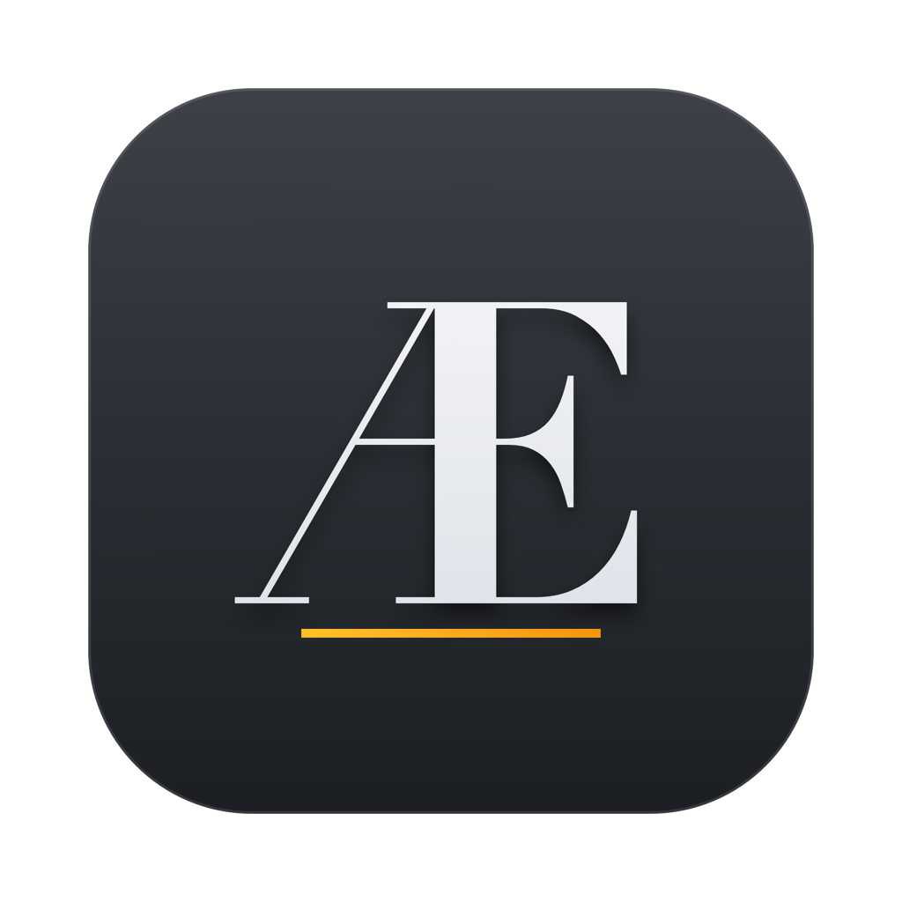

<p align="center">
  
</p>

# Assistant Editor

**macOS assistant-editing tool for documentary post-production.** Analyzes interview transcripts/subtitles with a local LLM, generates chapter markers and synopses, searches speech, builds DaVinci Resolve timelines, and offers RAG chat against interview material.

This repository is the **cross-platform porting source**. The reference implementation is a native macOS SwiftUI app; the goal of this repo is to enable third-party developers to produce **Linux and Windows** versions while reusing as much of the existing code as possible — especially the platform-neutral Python pipeline.

> **Status:** macOS reference app is complete (v1.24 — unified project bar, Script Beats / Timeline Beats editor, Save/Load edit archive; Sync-by-Transcript parked). A prebuilt Intel-agnostic macOS app bundle ships in `Releases/`. Linux/Windows ports are **not built yet** — this repo contains the reference source, the Python pipeline, and detailed porting guides.

---

## What the app does

1. **Project Setup** — pick folders of interviews; run LLM project analysis that extracts themes, keywords, and weights; manage a weighing slider UI; show a material tree with project-file health.
2. **AI Edit** — author a treatment + beats (or paste prose and auto-fill) → retrieve matching clips from transcripts → review flow → create a Resolve timeline.
3. **Timeline Assist** — search both subtitles and transcripts (FTS5 exact + semantic), generate per-interview chapter markers and synopses via LLM, assemble a DaVinci Resolve timeline from search hits with colored clip groups and gap video.
4. **Transcript Intelligence** — RAG chat against transcripts + markers using a local LLM; pre-computed per-interview knowledge base.

All AI runs **on-machine** — no cloud API. Two interchangeable local LLM backends are supported: **oMLX** (OpenAI-compatible server on port 8000) and **Ollama**.

---

## Quick start (try the app)

A prebuilt macOS app already sits in this repo:

```bash
# 1. Grab the bundle (it's ad-hoc signed — macOS will quarantine it)
open Releases/Assistant\ Editor.app        # first time: right-click → Open instead
#    or clear the quarantine outright:
#    xattr -dr com.apple.quarantine "Releases/Assistant Editor.app"

# 2. Install a local LLM
brew install ollama && ollama pull sonct988/gemma4-26b-a4b-it-q4km-256k

# 3. DaVinci Resolve (Studio or Free) for timeline/marker creation

# 4. The manual is in-app (⌘?) or at docs/MANUAL.md — read the "Getting Started" section
```

The bundle in `Releases/` is the latest build; for shareable distribution see `Releases/README.md` (zip it and attach to a GitHub Release).

---

## Repository layout

```
assistant-editor/
├── README.md                ← this file
├── icon.png                 ← app icon (1024×1024, programmatic Didot Æ)
├── CHANGELOG.md             ← version history
├── SECURITY.md              ← vulnerability reporting + project scope
├── CODE_OF_CONDUCT.md       ← Contributor Covenant 2.1
├── .github/
│   ├── ISSUE_TEMPLATE/      ← bug report + feature request forms
│   ├── PULL_REQUEST_TEMPLATE.md
│   ├── FUNDING.yml
│   └── workflows/           ← macOS CI smoke build (XcodeGen + xcodebuild)
├── docs/
│   ├── MANUAL.md           ← full user manual (v1.24 — every tool, ticker, slider)
│   ├── ARCHITECTURE.md     ← components, stores, data flow, IPC
│   ├── MACOS_REFERENCE.md  ← macOS build/deploy, hardcoded paths, Resolve bridge, shortcuts
│   ├── PORTING_LINUX.md    ← full Linux porting strategy
│   ├── PORTING_WINDOWS.md  ← full Windows porting strategy
│   ├── SCRIPT_INTERFACES.md ← Python script stdin/stdout contracts
│   ├── FILE_FORMATS.md     ← SRT/SRTX/TXT/_chapters.yaml/_synopsis.txt/_project.yaml
│   ├── DEPENDENCIES.md     ← runtime deps (LLM server, SQLite-FTS5, ffmpeg, Resolve)
│   ├── STORAGE.md          ← UserDefaults keys, cache files, database schema
│   └── LLM_BACKEND.md      ← LLM API contract (oMLX/Ollama) + prompt inventory
├── Releases/
│   ├── Assistant Editor.app ← latest prebuilt macOS app (v1.24, ad-hoc signed)
│   └── README.md            ← how to run / zip / distribute the bundle
├── source/
│   ├── Swift/               ← 29 .swift files (macOS reference UI/logic)
│   └── Python/              ← 17 .py scripts (platform-neutral pipeline)
├── project.yml              ← XcodeGen spec for the macOS app
├── setup.sh                 ← macOS build bootstrap (Xcode)
├── .gitignore
└── LICENSE
```

**The Python scripts are the crown jewels.** They do almost all of the real work (parsing, LLM calls, chapter/synopsis generation, timeline building, sync math) and are 100% standard-library + PyYAML + the DaVinci Resolve scripting API. A Linux or Windows port can reuse them **unchanged** if it only replaces the Swift UI layer and the `PythonBridge` subprocess runner.

---

## Building the macOS reference app

Requires Xcode 15+ and [XcodeGen](https://github.com/yonaskolb/XcodeGen).

```bash
sh setup.sh          # installs xcodegen, generates the .xcodeproj
open "Assistant Editor.xcodeproj"
# or headless:
xcodebuild -project "Assistant Editor.xcodeproj" -scheme "Assistant Editor" build
```

Runtime needs before first use:
- **oMLX** or **Ollama** running locally with a compatible model pulled (see `docs/LLM_BACKEND.md`).
- **DaVinci Resolve** (Studio or Free) if you want timeline/marker creation.
- **ffmpeg/ffprobe** for frame-rate detection and gap-clip generation.

---

## Porting at a glance

| Concern | macOS reference | Linux | Windows |
|---|---|---|---|
| UI | SwiftUI + AppKit panels | Tauri/GTK/Qt (see guide) | Tauri/WinUI/Electron (see guide) |
| App logic | Swift (29 files) | Reimplement in Rust/TS/JS/C# or keep Swift via SwiftWasm | Same choices |
| NLP embeddings | `NLEmbedding` (macOS-only) | `fastembed` / `onnxruntime` / local model | Same |
| Subprocess runner | `PythonBridge` (Foundation.Process) | `std::process` / `child_process` | `System.Diagnostics.Process` |
| SQLite+FTS5 | `SQLite3` C binding | `sqlite3` (same file-format, lib available) | same |
| LLM server | oMLX/Ollama local | same (cross-platform servers) | same |
| Resolve automation | macOS module path + GUI script bridge | Linux Resolve module path | Windows module path + `.so`/`.dll` |
| File dialogs | NSOpenPanel/NSSavePanel | GTK/Qt native | Win32 common dialogs |

Start with `docs/PORTING_LINUX.md` and `docs/PORTING_WINDOWS.md`; each is a step-by-step port plan with file-by-file mapping. To reproduce or debug the macOS reference behavior (Resolve bridge, hardcoded paths, build/deploy), read `docs/MACOS_REFERENCE.md`.

---

## License

See `LICENSE`. This is the author's proprietary project — a porting/reference repo for the author's use and for explicitly authorized third-party developers.